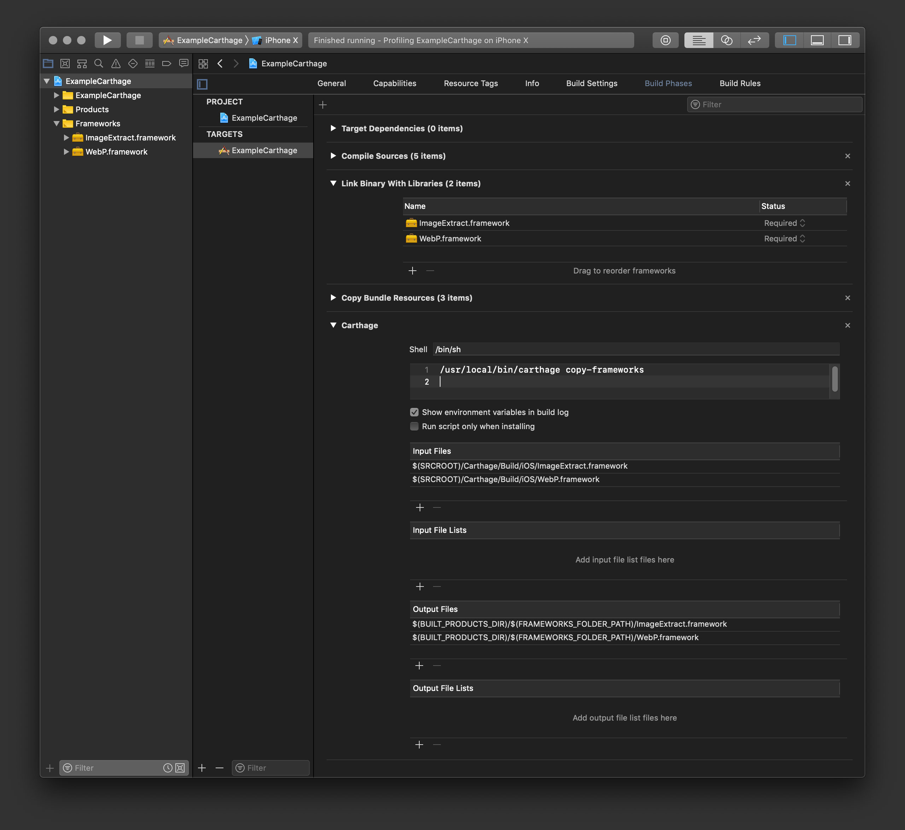

[](https://github.com/gumob/ImageExtract)
[](https://travis-ci.com/gumob/ImageExtract)
[](https://codecov.io/gh/gumob/ImageExtract)
[](https://github.com/gumob/ImageExtract)


# ImageExtract
A Swift library to allows you to extract the size of an image without downloading.

## Requirements

ImageExtract supports multiple platforms
- iOS 10.0 or later
- macOS 10.11 or later
- Swift 5.0 ore later

## Supported image format

- JPEG
- PNG
- GIF
- BMP
- WebP

## Installation

### Carthage

Add the following to your `Cartfile` and follow [these instructions](https://github.com/Carthage/Carthage#adding-frameworks-to-an-application).

```
github "gumob/ImageExtract"
```

Do not forget to include WebP.framework. Otherwise it will fail to build the application.<br/>




<!--
### CocoaPods

To integrate ImageExtract into your project, add the following to your `Podfile`.

```ruby
platform :ios, '10.0'
use_frameworks!

pod 'ImageExtract'
```
-->

## Usage

Read the [usage](https://gumob.github.io/ImageExtract/usage.html) and the [API reference](https://gumob.github.io/ImageExtract/Classes/ImageExtract.html) for detailed information.

### Initialization

Just import ImageExtract framework:
```swift
import ImageExtract
```

### Synchronous and asynchronous request

Get the size of an image synchronously:
```swift
let url: String = "https://example.com/image.jpg"
let extractor: ImageExtract = ImageExtract()
let result: (size: CGSize, isFinished: Bool) = extractor.extract(url)
print(result.size) // (800.0, 600.0)
```

Get the size of an image asynchronously:
```swift
let url: String = "https://example.com/image.jpg"
let extractor: ImageExtract = ImageExtract()
extractor.extract(request) { (url: String?, size: CGSize, isFinished: Bool) in
    print(size) // (800.0, 600.0)
}
```

## Copyright

ImageExtract is released under MIT license, which means you can modify it, redistribute it or use it however you like.
